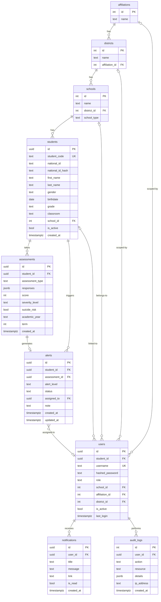

# Database Schema — LEMCS
## Loei Educational MindCare System

> อ้างอิงจาก [db_models.py](file:///d:/@LEMCS/backend/app/models/db_models.py) — อัปเดตล่าสุด 27 มี.ค. 2569

---

## ER Diagram



---

## รายละเอียดตาราง

### 1. `affiliations` — สังกัด

| Column | Type | Constraints | หมายเหตุ |
|---|---|---|---|
| `id` | INTEGER | PK | |
| `name` | TEXT | NOT NULL | ชื่อสังกัดเช่น "สพฐ.", "อาชีวศึกษา" |

**Seed data:** 4 สังกัด (อาชีวะ, สพฐ., เอกชน, กศน.)

---

### 2. `districts` — เขตพื้นที่

| Column | Type | Constraints | หมายเหตุ |
|---|---|---|---|
| `id` | INTEGER | PK | |
| `name` | TEXT | NOT NULL | เช่น "สพป.เลย เขต 1" |
| `affiliation_id` | INTEGER | FK → affiliations | สังกัดที่เขตนี้อยู่ภายใต้ |

**Seed data:** 7 เขตพื้นที่

---

### 3. `schools` — โรงเรียน/สถานศึกษา

| Column | Type | Constraints | หมายเหตุ |
|---|---|---|---|
| `id` | INTEGER | PK | |
| `name` | TEXT | NOT NULL | ชื่อสถานศึกษา |
| `district_id` | INTEGER | FK → districts | เขตพื้นที่ที่สถานศึกษาสังกัดอยู่ |
| `school_type` | TEXT | | ประเภท: ประถมศึกษา, มัธยมศึกษา, อาชีวศึกษา, เอกชน, กศน. |

**Seed data:** 10 โรงเรียน

---

### 4. `students` — นักเรียน

| Column | Type | Constraints | หมายเหตุ |
|---|---|---|---|
| `id` | UUID | PK, default uuid4 | |
| `student_code` | TEXT | UNIQUE, NOT NULL | รหัสนักเรียน |
| `national_id` | TEXT | | เลขบัตรประชาชน (AES-256 encrypted) |
| `national_id_hash` | TEXT | | Hash SHA-256 สำหรับค้นหา/ล็อกอิน |
| `first_name` | TEXT | NOT NULL | ชื่อ |
| `last_name` | TEXT | NOT NULL | นามสกุล |
| `gender` | TEXT | | male / female |
| `birthdate` | DATE | | วัน/เดือน/ปีเกิด |
| `grade` | TEXT | | ระดับชั้น เช่น "ม.1", "ปวช.2" |
| `classroom` | TEXT | | ห้อง เช่น "1", "2" |
| `school_id` | INTEGER | FK → schools | โรงเรียนที่สังกัด |
| `is_active` | BOOLEAN | default true | สถานะบัญชี |
| `created_at` | TIMESTAMPTZ | default now() | |

> ⚠️ **PDPA**: `national_id` เข้ารหัส AES-256, ใช้ `national_id_hash` (SHA-256) สำหรับค้นหาและยืนยันตัวตน

---

### 5. `users` — ผู้ใช้งานระบบ

| Column | Type | Constraints | หมายเหตุ |
|---|---|---|---|
| `id` | UUID | PK, default uuid4 | |
| `student_id` | UUID | FK → students, nullable | เชื่อมกับนักเรียน (role=student) |
| `username` | TEXT | UNIQUE | |
| `hashed_password` | TEXT | | bcrypt hash |
| `role` | TEXT | NOT NULL | `systemadmin` \| `superadmin` \| `commissionadmin` \| `schooladmin` \| `student` |
| `school_id` | INTEGER | FK → schools, nullable | สำหรับ schooladmin |
| `affiliation_id` | INTEGER | FK → affiliations, nullable | สำหรับ commissionadmin (ผูกสังกัด) |
| `district_id` | INTEGER | FK → districts, nullable | สำหรับ commissionadmin (ผูกเขตพื้นที่) |
| `is_active` | BOOLEAN | default true | |
| `last_login` | TIMESTAMPTZ | | |

**Role ↔ FK mapping:**

| Role | school_id | affiliation_id | district_id |
|---|:---:|:---:|:---:|
| systemadmin | — | — | — |
| superadmin | — | — | — |
| commissionadmin | — | ✅ หรือ — | ✅ |
| schooladmin | ✅ | — | — |
| student | — | — | — |

---

### 6. `assessments` — ผลการประเมิน

| Column | Type | Constraints | หมายเหตุ |
|---|---|---|---|
| `id` | UUID | PK, default uuid4 | |
| `student_id` | UUID | FK → students, NOT NULL | |
| `assessment_type` | TEXT | NOT NULL | `ST5` (ความเครียด), `PHQA` (ซึมเศร้า), `CDI` (ซึมเศร้าเด็ก) |
| `responses` | JSONB | NOT NULL | คำตอบแต่ละข้อ `{"answers": [0,1,2,...]}` |
| `score` | INTEGER | NOT NULL | คะแนนรวม |
| `severity_level` | TEXT | NOT NULL | `normal` \| `mild` \| `moderate` \| `severe` \| `very_severe` |
| `suicide_risk` | BOOLEAN | default false | ความเสี่ยงฆ่าตัวตาย |
| `academic_year` | TEXT | | ปีการศึกษา เช่น "2567" |
| `term` | INTEGER | | ภาคเรียน (1 หรือ 2) |
| `created_at` | TIMESTAMPTZ | default now() | |

---

### 7. `alerts` — การแจ้งเตือน

| Column | Type | Constraints | หมายเหตุ |
|---|---|---|---|
| `id` | UUID | PK, default uuid4 | |
| `student_id` | UUID | FK → students | |
| `assessment_id` | UUID | FK → assessments | ผลประเมินที่ trigger |
| `alert_level` | TEXT | | `high` \| `critical` |
| `status` | TEXT | default "new" | `new` → `in_progress` → `resolved` / `closed` |
| `assigned_to` | UUID | FK → users, nullable | ผู้รับผิดชอบ |
| `note` | TEXT | | บันทึกการดำเนินการ |
| `created_at` | TIMESTAMPTZ | default now() | |
| `updated_at` | TIMESTAMPTZ | default now(), on update | |

---

### 8. `notifications` — การแจ้งเตือนในแอป

| Column | Type | Constraints | หมายเหตุ |
|---|---|---|---|
| `id` | UUID | PK, default uuid4 | |
| `user_id` | UUID | FK → users, NOT NULL | ผู้รับ |
| `title` | TEXT | NOT NULL | หัวข้อ |
| `message` | TEXT | NOT NULL | เนื้อหา |
| `link` | TEXT | | URL สำหรับกดดูรายละเอียด |
| `is_read` | BOOLEAN | default false | |
| `created_at` | TIMESTAMPTZ | default now() | |

---

### 9. `audit_logs` — บันทึกการเข้าถึงข้อมูล

| Column | Type | Constraints | หมายเหตุ |
|---|---|---|---|
| `id` | INTEGER | PK, auto increment | |
| `user_id` | UUID | FK → users | ผู้กระทำ |
| `action` | TEXT | NOT NULL | เช่น `view_alert`, `update_alert`, `login` |
| `resource` | TEXT | | เช่น `alert:uuid`, `student:uuid` |
| `details` | JSONB | | ข้อมูลเพิ่มเติม |
| `ip_address` | TEXT | | IP ของผู้ใช้ |
| `created_at` | TIMESTAMPTZ | default now() | |

---

## PostgreSQL Extensions

```sql
CREATE EXTENSION IF NOT EXISTS "uuid-ossp";   -- uuid_generate_v4()
CREATE EXTENSION IF NOT EXISTS "pgcrypto";    -- gen_random_uuid(), encryption
```

---

## Hierarchy Relationship

```
affiliations (สังกัด)
  └── districts (เขตพื้นที่)
       └── schools (โรงเรียน)
            └── students (นักเรียน)
                 └── assessments (ผลประเมิน)
                      └── alerts (แจ้งเตือน)
```
