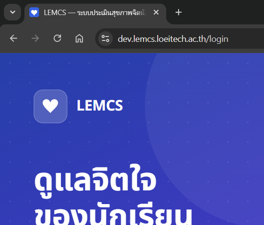

# คู่มือการใช้งานระบบ LEMCS
## Loei Educational MindCare System

> **เวอร์ชัน**: 1.0 | **ปรับปรุงล่าสุด**: เมษายน 2569  
> **ผู้ดูแล**: ฝ่ายเทคโนโลยีสารสนเทศ จังหวัดเลย

---

## สารบัญ

1. [ภาพรวมระบบ](#1-ภาพรวมระบบ)
2. [การเข้าใช้งาน — นักเรียน](#2-การเข้าใช้งาน--นักเรียน)
3. [การทำแบบประเมิน](#3-การทำแบบประเมิน)
4. [การดูผลประเมิน](#4-การดูผลประเมิน)
5. [การเข้าใช้งาน — ผู้ดูแลระบบ](#5-การเข้าใช้งาน--ผู้ดูแลระบบ)
6. [แดชบอร์ดผู้ดูแลระบบ](#6-แดชบอร์ดผู้ดูแลระบบ)
7. [การจัดการนักเรียน](#7-การจัดการนักเรียน)
8. [การจัดการโรงเรียน](#8-การจัดการโรงเรียน)
9. [การนำเข้าข้อมูล](#9-การนำเข้าข้อมูล)
10. [การแจ้งเตือน](#10-การแจ้งเตือน)
11. [รายงาน](#11-รายงาน)
12. [คำถามที่พบบ่อย](#12-คำถามที่พบบ่อย)

---

## 1. ภาพรวมระบบ

LEMCS (Loei Educational MindCare System) คือระบบประเมินสุขภาพจิตสำหรับนักเรียน K-12 ในจังหวัดเลย รองรับแบบประเมิน 3 ประเภท:

| แบบประเมิน | กลุ่มเป้าหมาย | วัดอะไร |
|-----------|--------------|---------|
| ST-5 | นักเรียนทุกช่วงอายุ (7 ปีขึ้นไป) | ระดับความเครียด |
| CDI | นักเรียนอายุ 7–17 ปี | ภาวะซึมเศร้าในเด็ก |
| PHQ-A | นักเรียนอายุ 18 ปีขึ้นไป | ภาวะซึมเศร้าในวัยรุ่น |

### ผู้ใช้งานระบบ

```
นักเรียน ─────────► ทำแบบประเมิน → ดูผลประเมิน
ครู/อาจารย์ ────────► ติดตามนักเรียนในความดูแล
ผู้บริหารโรงเรียน ──► ดูรายงานภาพรวมโรงเรียน
ผู้ดูแลระบบ ────────► จัดการข้อมูลทั้งหมด
```

> **หมายเหตุ**: ระบบรองรับการใช้งานบนมือถือ (Mobile-first) และสามารถใช้งานแบบออฟไลน์ได้หลังจาก Login ครั้งแรก

---

## 2. การเข้าใช้งาน — นักเรียน

### 2.1 เปิดระบบ

เปิดเบราว์เซอร์แล้วไปที่ `https://lemcs.loeitech.ac.th`

```
📸 SCREENSHOT-01: หน้าแรกของระบบ (URL bar แสดง lemcs.loeitech.ac.th)
```

---

### 2.2 หน้าเข้าสู่ระบบนักเรียน

ระบบจะแสดงหน้า Login สำหรับนักเรียน

```
📸 SCREENSHOT-02: หน้า Login นักเรียน
    [แทรกภาพ: screenshots/02-student-login.png]
    — แสดงช่องกรอก: รหัสนักเรียน, วันเดือนปีเกิด, เลขบัตรประชาชน
```

**ขั้นตอนการ Login:**

1. กรอก **รหัสนักเรียน** (Student Code)
2. กรอก **วันเดือนปีเกิด** (รูปแบบ: วัน/เดือน/ปี พ.ศ.)
3. กรอก **เลขบัตรประชาชน** 13 หลัก
4. กดปุ่ม **"เข้าสู่ระบบ"**

```
📸 SCREENSHOT-03: กรอกข้อมูล Login ครบถ้วน (ก่อนกดปุ่ม)
    [แทรกภาพ: screenshots/03-student-login-filled.png]
```

---

### 2.3 หน้ายินยอมการใช้ข้อมูล (PDPA)

**เฉพาะการ Login ครั้งแรก** ระบบจะแสดงข้อความยินยอมการใช้ข้อมูลส่วนบุคคล (PDPA)

```
📸 SCREENSHOT-04: หน้าต่าง Consent Modal (PDPA)
    [แทรกภาพ: screenshots/04-consent-modal.png]
    — แสดงเนื้อหาข้อตกลง, ปุ่ม "ยินยอม" และ "ปฏิเสธ"
```

- อ่านเนื้อหาข้อตกลง
- กดปุ่ม **"ยินยอม"** เพื่อดำเนินการต่อ

> ⚠️ หากกด "ปฏิเสธ" จะไม่สามารถใช้งานระบบได้

---

## 3. การทำแบบประเมิน

### 3.1 หน้าแดชบอร์ดนักเรียน

หลัง Login สำเร็จ จะเห็นหน้าแดชบอร์ดแสดงแบบประเมินที่ทำได้

```
📸 SCREENSHOT-05: แดชบอร์ดนักเรียน
    [แทรกภาพ: screenshots/05-student-dashboard.png]
    — แสดงการ์ดแบบประเมิน ST-5 / CDI / PHQ-A
    — แสดงสถานะ: ยังไม่เคยทำ / ทำแล้ว (วันที่)
    — แสดงประวัติการทำแบบประเมินล่าสุด
```

**คำอธิบายการ์ดแบบประเมิน:**

| ไอคอน | ความหมาย |
|-------|---------|
| 🟢 | ยังไม่เคยทำ — พร้อมทำ |
| 🔵 | ทำแล้ว — แสดงผลครั้งล่าสุด |
| 🔒 | ไม่ตรงกับช่วงอายุ — ใช้งานไม่ได้ |

---

### 3.2 เลือกแบบประเมิน

กดที่การ์ดแบบประเมินที่ต้องการ เช่น **"ST-5 แบบประเมินความเครียด"**

```
📸 SCREENSHOT-06: กดเลือกแบบประเมิน ST-5
    [แทรกภาพ: screenshots/06-select-assessment.png]
```

---

### 3.3 หน้าทำแบบประเมิน

ระบบจะแสดงคำถามทีละข้อ พร้อม Progress Bar แสดงความคืบหน้า

```
📸 SCREENSHOT-07: หน้าคำถามแบบประเมิน
    [แทรกภาพ: screenshots/07-assessment-question.png]
    — แสดง: Progress Bar บนสุด (เช่น "ข้อ 1 จาก 5")
    — แสดง: ข้อความคำถาม
    — แสดง: ตัวเลือกคำตอบ (ปุ่มกลม)
```

**ขั้นตอน:**
1. อ่านคำถามให้ครบ
2. เลือกคำตอบที่ตรงกับสภาวะของตนเองมากที่สุด
3. กดปุ่ม **"ถัดไป"** เพื่อไปข้อถัดไป

```
📸 SCREENSHOT-08: เลือกคำตอบแล้ว (ก่อนกด "ถัดไป")
    [แทรกภาพ: screenshots/08-assessment-answered.png]
    — แสดงตัวเลือกที่ถูกเลือก (highlighted)
    — ปุ่ม "ถัดไป" active
```

> **หมายเหตุ**: สามารถกดปุ่ม **"ย้อนกลับ"** เพื่อแก้ไขคำตอบข้อก่อนหน้าได้

---

### 3.4 ข้อสุดท้าย — ยืนยันการส่ง

เมื่อตอบครบทุกข้อ ระบบจะแสดงปุ่ม **"ส่งแบบประเมิน"**

```
📸 SCREENSHOT-09: ข้อสุดท้าย พร้อมกดส่ง
    [แทรกภาพ: screenshots/09-assessment-last-question.png]
    — Progress Bar แสดง 100%
    — ปุ่ม "ส่งแบบประเมิน" (สีเขียว)
```

กดปุ่ม **"ส่งแบบประเมิน"** เพื่อดูผล

---

## 4. การดูผลประเมิน

### 4.1 หน้าผลการประเมิน

ระบบแสดงผลคะแนนและระดับสุขภาพจิตทันทีหลังส่ง

```
📸 SCREENSHOT-10: หน้าผลการประเมิน (ระดับปกติ)
    [แทรกภาพ: screenshots/10-result-normal.png]
    — แสดง: คะแนนรวม
    — แสดง: ระดับผล (ปกติ / เล็กน้อย / ปานกลาง / รุนแรง)
    — แสดง: คำแนะนำเบื้องต้น
```

**ระดับผลการประเมิน ST-5:**

| คะแนน | ระดับ | สีแสดงผล |
|-------|-------|---------|
| 0–4 | ปกติ | 🟢 เขียว |
| 5–7 | เครียดน้อย | 🟡 เหลือง |
| 8–9 | เครียดปานกลาง | 🟠 ส้ม |
| 10–15 | เครียดมาก | 🔴 แดง |

---

### 4.2 กรณีพบความเสี่ยง (PHQ-A ข้อ 9)

หากตรวจพบความเสี่ยงด้านการทำร้ายตนเอง ระบบจะแสดงหน้าวิกฤตทันที

```
📸 SCREENSHOT-11: หน้าแสดงทรัพยากรวิกฤต (Crisis Resources)
    [แทรกภาพ: screenshots/11-crisis-resources.png]
    — แสดง: แบนเนอร์สีแดง "ต้องการความช่วยเหลือ?"
    — แสดง: เบอร์โทร สายด่วนสุขภาพจิต 1323
    — แสดง: ปุ่ม "โทรหาผู้ดูแล" / "โทร 1323"
```

> ⚠️ **สำคัญ**: หากพบหน้านี้ กรุณาติดต่อผู้ดูแลใกล้ชิดทันที หรือโทร **1323**

---

### 4.3 ประวัติการประเมิน

กลับไปหน้าแดชบอร์ด สามารถดูประวัติการทำแบบประเมินย้อนหลังได้

```
📸 SCREENSHOT-12: รายการประวัติการประเมิน
    [แทรกภาพ: screenshots/12-assessment-history.png]
    — แสดงรายการเรียงตามวันที่ (ล่าสุดก่อน)
    — แสดง: วันที่ทำ, ประเภทแบบประเมิน, คะแนน, ระดับ
```

กดที่รายการเพื่อดูรายละเอียดผลครั้งนั้น

---

## 5. การเข้าใช้งาน — ผู้ดูแลระบบ

### 5.1 หน้า Login ผู้ดูแลระบบ

ไปที่ `https://lemcs.loeitech.ac.th/admin-login`

```
📸 SCREENSHOT-13: หน้า Login Admin
    [แทรกภาพ: screenshots/13-admin-login.png]
    — แสดงช่อง: ชื่อผู้ใช้ (Username), รหัสผ่าน (Password)
    — ปุ่ม "เข้าสู่ระบบ"
```

**ขั้นตอน:**
1. กรอก **ชื่อผู้ใช้** (Username)
2. กรอก **รหัสผ่าน** (Password)
3. กดปุ่ม **"เข้าสู่ระบบ"**

```
📸 SCREENSHOT-14: กรอก Username/Password Admin (ก่อนกดปุ่ม)
    [แทรกภาพ: screenshots/14-admin-login-filled.png]
```

---

## 6. แดชบอร์ดผู้ดูแลระบบ

### 6.1 ภาพรวมแดชบอร์ด

หลัง Login สำเร็จ จะเห็นแดชบอร์ดภาพรวมของระบบ

```
📸 SCREENSHOT-15: Admin Dashboard — ภาพรวม
    [แทรกภาพ: screenshots/15-admin-dashboard.png]
    — Sidebar เมนูซ้าย: แดชบอร์ด, นักเรียน, โรงเรียน, นำเข้าข้อมูล, แจ้งเตือน, รายงาน, ตั้งค่า
    — Stats Cards: จำนวนนักเรียนทั้งหมด, ทำแบบประเมินวันนี้, รอการดูแล, แจ้งเตือนใหม่
    — กราฟ: แนวโน้มการทำแบบประเมินรายสัปดาห์
```

### 6.2 Stats Cards — ตัวเลขสำคัญ

```
📸 SCREENSHOT-16: Stats Cards (ขยายภาพ)
    [แทรกภาพ: screenshots/16-stats-cards.png]
    — การ์ด 4 ใบ: นักเรียนทั้งหมด / ทำแบบประเมินวันนี้ / รอดูแล / แจ้งเตือน
```

| การ์ด | ความหมาย |
|------|---------|
| นักเรียนทั้งหมด | จำนวนนักเรียนในระบบ |
| ทำแบบประเมินวันนี้ | จำนวนนักเรียนที่ทำแบบประเมินวันนี้ |
| รอการดูแล | นักเรียนที่ผลประเมินอยู่ในระดับที่ต้องติดตาม |
| แจ้งเตือนใหม่ | การแจ้งเตือนที่ยังไม่ได้รับการจัดการ |

---

### 6.3 Insight Panel

```
📸 SCREENSHOT-17: Insight Panel (แผงวิเคราะห์)
    [แทรกภาพ: screenshots/17-insight-panel.png]
    — แสดงกราฟแนวโน้ม / สัดส่วนระดับผล / การเปรียบเทียบรายโรงเรียน
```

---

## 7. การจัดการนักเรียน

### 7.1 รายการนักเรียน

กดเมนู **"นักเรียน"** ในแถบด้านซ้าย

```
📸 SCREENSHOT-18: หน้ารายการนักเรียน
    [แทรกภาพ: screenshots/18-student-list.png]
    — ตารางแสดง: ชื่อ-สกุล, รหัส, โรงเรียน, ชั้น, สถานะล่าสุด
    — ช่องค้นหา (Search bar)
    — ตัวกรอง: โรงเรียน, ชั้นปี, สถานะ
    — ปุ่ม "เพิ่มนักเรียน"
```

### 7.2 ค้นหาและกรองข้อมูล

```
📸 SCREENSHOT-19: การใช้ Filter Bar
    [แทรกภาพ: screenshots/19-filter-bar.png]
    — แสดง Dropdown: เลือกโรงเรียน / เลือกชั้นปี / เลือกสถานะผล
    — ผลลัพธ์อัปเดตแบบ Real-time
```

**วิธีกรอง:**
1. พิมพ์ชื่อหรือรหัสในช่อง **"ค้นหา"**
2. เลือกโรงเรียนจาก Dropdown **"โรงเรียน"**
3. เลือกชั้นปีจาก Dropdown **"ชั้นปี"**
4. กด **"ล้างตัวกรอง"** เพื่อรีเซ็ต

---

### 7.3 ดูข้อมูลนักเรียนรายบุคคล

กดที่ชื่อนักเรียนในตาราง

```
📸 SCREENSHOT-20: หน้าโปรไฟล์นักเรียน
    [แทรกภาพ: screenshots/20-student-profile.png]
    — แสดง: ข้อมูลส่วนตัว (ชื่อ, โรงเรียน, ชั้น, อายุ)
    — แสดง: ประวัติการทำแบบประเมินทั้งหมด
    — แสดง: กราฟแนวโน้มคะแนน
    — ปุ่ม "แก้ไขข้อมูล"
```

---

### 7.4 เพิ่มนักเรียนใหม่

กดปุ่ม **"+ เพิ่มนักเรียน"** มุมขวาบน

```
📸 SCREENSHOT-21: ฟอร์มเพิ่มนักเรียนใหม่
    [แทรกภาพ: screenshots/21-add-student-form.png]
    — ช่อง: ชื่อ, นามสกุล, รหัสนักเรียน, วันเกิด, เลขบัตรประชาชน, โรงเรียน, ชั้น
    — ปุ่ม "บันทึก" / "ยกเลิก"
```

กรอกข้อมูลให้ครบแล้วกด **"บันทึก"**

```
📸 SCREENSHOT-22: กรอกข้อมูลนักเรียนใหม่ครบถ้วน
    [แทรกภาพ: screenshots/22-add-student-filled.png]
```

---

### 7.5 แก้ไขและลบนักเรียน

```
📸 SCREENSHOT-23: ปุ่มแก้ไข/ลบในตาราง
    [แทรกภาพ: screenshots/23-student-edit-delete.png]
    — ปุ่ม ✏️ แก้ไข (สีน้ำเงิน)
    — ปุ่ม 🗑️ ลบ (สีแดง) — มี Confirm Dialog ก่อนลบ
```

---

## 8. การจัดการโรงเรียน

### 8.1 รายการโรงเรียน

กดเมนู **"โรงเรียน"** ในแถบด้านซ้าย

```
📸 SCREENSHOT-24: หน้ารายการโรงเรียน
    [แทรกภาพ: screenshots/24-school-list.png]
    — ตารางแสดง: ชื่อโรงเรียน, อำเภอ, จำนวนนักเรียน, สถานะ
    — ปุ่ม "เพิ่มโรงเรียน"
```

### 8.2 เพิ่ม/แก้ไขโรงเรียน

```
📸 SCREENSHOT-25: ฟอร์มเพิ่ม/แก้ไขโรงเรียน
    [แทรกภาพ: screenshots/25-school-form.png]
    — ช่อง: ชื่อโรงเรียน, อำเภอ, สังกัด, ที่อยู่
    — ปุ่ม "บันทึก" / "ยกเลิก"
```

---

## 9. การนำเข้าข้อมูล

### 9.1 หน้านำเข้าข้อมูล

กดเมนู **"นำเข้าข้อมูล"** ในแถบด้านซ้าย

```
📸 SCREENSHOT-26: หน้า Import ข้อมูล
    [แทรกภาพ: screenshots/26-import-page.png]
    — แสดงพื้นที่ลาก-วางไฟล์ (Drag & Drop zone)
    — ปุ่ม "เลือกไฟล์" (.xlsx / .csv)
    — ลิงก์ "ดาวน์โหลดเทมเพลต"
```

### 9.2 เตรียมไฟล์ข้อมูล

**ดาวน์โหลดเทมเพลต** กดลิงก์ "ดาวน์โหลดเทมเพลต" เพื่อรับไฟล์ Excel ต้นแบบ

```
📸 SCREENSHOT-27: ตัวอย่างเทมเพลต Excel
    [แทรกภาพ: screenshots/27-import-template.png]
    — แสดงหัวคอลัมน์: student_code, first_name, last_name, birthdate, national_id, school_id, grade
```

**รูปแบบข้อมูลที่ต้องการ:**

| คอลัมน์ | รูปแบบ | ตัวอย่าง |
|---------|--------|---------|
| student_code | ตัวเลข/ตัวอักษร | 12345 |
| first_name | ภาษาไทย | สมชาย |
| last_name | ภาษาไทย | ใจดี |
| birthdate | YYYY-MM-DD | 2010-05-15 |
| national_id | ตัวเลข 13 หลัก | 1234567890123 |
| school_id | รหัสโรงเรียน | SCH001 |
| grade | ระดับชั้น | ม.1 |

---

### 9.3 อัปโหลดและตรวจสอบ

1. ลากไฟล์มาวางในพื้นที่ Drag & Drop หรือกดปุ่ม **"เลือกไฟล์"**

```
📸 SCREENSHOT-28: เลือกไฟล์แล้ว (ก่อนอัปโหลด)
    [แทรกภาพ: screenshots/28-import-file-selected.png]
    — แสดงชื่อไฟล์ที่เลือก
    — ปุ่ม "อัปโหลด"
```

2. กดปุ่ม **"อัปโหลด"** ระบบจะตรวจสอบข้อมูล

```
📸 SCREENSHOT-29: ผลการตรวจสอบข้อมูล (Preview)
    [แทรกภาพ: screenshots/29-import-preview.png]
    — แสดง: จำนวนแถวที่ถูกต้อง / มีข้อผิดพลาด
    — ตารางแสดงข้อมูล Preview
    — ข้อผิดพลาด (ถ้ามี) ไฮไลต์สีแดง
```

3. ตรวจสอบข้อมูล Preview แล้วกด **"ยืนยันนำเข้า"**

```
📸 SCREENSHOT-30: นำเข้าสำเร็จ
    [แทรกภาพ: screenshots/30-import-success.png]
    — แสดง: "นำเข้าข้อมูลสำเร็จ X รายการ"
```

---

## 10. การแจ้งเตือน

### 10.1 รายการแจ้งเตือน

กดเมนู **"การแจ้งเตือน"** ในแถบด้านซ้าย

```
📸 SCREENSHOT-31: หน้ารายการแจ้งเตือน
    [แทรกภาพ: screenshots/31-alerts-list.png]
    — แสดงรายการเรียงตามความเร่งด่วน
    — สีแดง: วิกฤต (Suicide Risk) — ต้องดำเนินการทันที
    — สีส้ม: รุนแรง — ควรดำเนินการภายใน 24 ชั่วโมง
    — สีเหลือง: ปานกลาง — ควรติดตาม
```

### 10.2 การแจ้งเตือนวิกฤต

```
📸 SCREENSHOT-32: การแจ้งเตือนวิกฤต (Critical Alert)
    [แทรกภาพ: screenshots/32-critical-alert.png]
    — แบนเนอร์สีแดงด้านบน
    — แสดง: ชื่อนักเรียน (สิทธิ์ที่เหมาะสม), โรงเรียน, เวลาที่เกิด
    — ปุ่ม "รับทราบ" / "ดูรายละเอียด"
```

> ⚠️ **การแจ้งเตือนวิกฤต** จะส่งการแจ้งเตือนผ่าน LINE Notify → Email → ระบบ ตามลำดับ

### 10.3 การรับทราบและจัดการแจ้งเตือน

```
📸 SCREENSHOT-33: หน้าจัดการแจ้งเตือน (รับทราบแล้ว)
    [แทรกภาพ: screenshots/33-alert-acknowledged.png]
    — แสดงสถานะ: รอดำเนินการ / รับทราบแล้ว / เสร็จสิ้น
    — ช่องบันทึกหมายเหตุ
```

---

## 11. รายงาน

### 11.1 หน้ารายงาน

กดเมนู **"รายงาน"** ในแถบด้านซ้าย

```
📸 SCREENSHOT-34: หน้ารายงาน (ภาพรวม)
    [แทรกภาพ: screenshots/34-reports-overview.png]
    — แท็บ: ภาพรวมจังหวัด / รายโรงเรียน / รายชั้นปี / รายช่วงเวลา
```

### 11.2 กรองรายงาน

```
📸 SCREENSHOT-35: การกรองรายงาน
    [แทรกภาพ: screenshots/35-reports-filter.png]
    — เลือก: ช่วงเวลา (วันที่เริ่มต้น - สิ้นสุด)
    — เลือก: โรงเรียน / อำเภอ
    — เลือก: ประเภทแบบประเมิน (ST-5 / CDI / PHQ-A)
    — กด "ดูรายงาน"
```

### 11.3 ส่งออกรายงาน

```
📸 SCREENSHOT-36: ปุ่มส่งออกรายงาน
    [แทรกภาพ: screenshots/36-export-report.png]
    — ปุ่ม "ส่งออก Excel" (.xlsx)
    — ปุ่ม "ส่งออก PDF"
```

---

## 12. คำถามที่พบบ่อย

### สำหรับนักเรียน

**Q: ลืมรหัสนักเรียนต้องทำอย่างไร?**
A: ติดต่อครูที่ปรึกษาหรือฝ่ายทะเบียนของโรงเรียน เพื่อขอรหัสนักเรียน

**Q: ทำแบบประเมินค้างไว้ครึ่งทาง สามารถกลับมาทำต่อได้ไหม?**
A: ไม่ได้ ต้องเริ่มทำใหม่ตั้งแต่ต้น เพราะระบบไม่บันทึกความคืบหน้าบางส่วน

**Q: ผลประเมินจะถูกเปิดเผยให้ใครเห็นบ้าง?**
A: ครูที่ปรึกษาและผู้บริหารโรงเรียน ไม่เปิดเผยต่อสาธารณะ และคุ้มครองตาม พ.ร.บ. PDPA

**Q: ใช้งานออฟไลน์ได้ไหม?**
A: ได้ หลังจาก Login ครั้งแรกผ่าน Wi-Fi แล้ว สามารถทำแบบประเมินได้แม้ไม่มีอินเทอร์เน็ต ผลจะซิงค์เมื่อมีสัญญาณอีกครั้ง

---

### สำหรับผู้ดูแลระบบ

**Q: ลืมรหัสผ่าน Admin ต้องทำอย่างไร?**
A: ติดต่อ System Administrator เพื่อรีเซ็ตรหัสผ่าน

**Q: นำเข้าข้อมูลล้มเหลว ต้องตรวจสอบอะไร?**
A: ตรวจสอบ (1) รูปแบบไฟล์ต้องเป็น .xlsx หรือ .csv (2) หัวคอลัมน์ตรงกับเทมเพลต (3) เลขบัตรประชาชน 13 หลัก (4) รูปแบบวันที่ YYYY-MM-DD

**Q: ไม่ได้รับ LINE Notify แจ้งเตือนวิกฤต?**
A: ตรวจสอบการตั้งค่า LINE Notify Token ในเมนู **"ตั้งค่า → การแจ้งเตือน"**

---

## ภาคผนวก

### A. ช่องทางติดต่อสนับสนุน

| ช่องทาง | ข้อมูลติดต่อ |
|--------|------------|
| Email | support@lemcs.loeitech.ac.th |
| โทรศัพท์ | 042-XXX-XXXX (วันจันทร์–ศุกร์ 08:00–17:00) |
| LINE OA | @lemcs-support |

### B. เบอร์โทรฉุกเฉิน

| สายด่วน | เบอร์ |
|--------|------|
| สายด่วนสุขภาพจิต | **1323** |
| สายด่วนเด็กและเยาวชน | **1387** |
| ฉุกเฉิน | **191** |

---

### C. รายการภาพที่ต้องแคปหน้าจอ

| ลำดับ | ชื่อไฟล์ | หน้าจอที่ต้องแคป | URL |
|-------|---------|-----------------|-----|
| 01 | 01-homepage.png | หน้าแรกระบบ | / |
| 02 | 02-student-login.png | หน้า Login นักเรียน (ว่าง) | /login |
| 03 | 03-student-login-filled.png | หน้า Login นักเรียน (กรอกแล้ว) | /login |
| 04 | 04-consent-modal.png | Consent Modal (Login ครั้งแรก) | /login |
| 05 | 05-student-dashboard.png | แดชบอร์ดนักเรียน | /dashboard |
| 06 | 06-select-assessment.png | กดเลือกแบบประเมิน | /dashboard |
| 07 | 07-assessment-question.png | คำถามแบบประเมิน (ข้อแรก) | /assess/st5 |
| 08 | 08-assessment-answered.png | เลือกคำตอบแล้ว | /assess/st5 |
| 09 | 09-assessment-last-question.png | ข้อสุดท้าย | /assess/st5 |
| 10 | 10-result-normal.png | ผลประเมิน (ระดับปกติ) | /result/[id] |
| 11 | 11-crisis-resources.png | หน้าวิกฤต Crisis Resources | /result/[id] |
| 12 | 12-assessment-history.png | ประวัติการประเมิน | /dashboard |
| 13 | 13-admin-login.png | หน้า Login Admin (ว่าง) | /admin-login |
| 14 | 14-admin-login-filled.png | หน้า Login Admin (กรอกแล้ว) | /admin-login |
| 15 | 15-admin-dashboard.png | Admin Dashboard (ภาพรวม) | /admin/dashboard |
| 16 | 16-stats-cards.png | Stats Cards (ขยาย) | /admin/dashboard |
| 17 | 17-insight-panel.png | Insight Panel | /admin/dashboard |
| 18 | 18-student-list.png | รายการนักเรียน | /admin/students |
| 19 | 19-filter-bar.png | Filter Bar | /admin/students |
| 20 | 20-student-profile.png | โปรไฟล์นักเรียน | /admin/students/[id] |
| 21 | 21-add-student-form.png | ฟอร์มเพิ่มนักเรียน (ว่าง) | /admin/students |
| 22 | 22-add-student-filled.png | ฟอร์มเพิ่มนักเรียน (กรอกแล้ว) | /admin/students |
| 23 | 23-student-edit-delete.png | ปุ่มแก้ไข/ลบในตาราง | /admin/students |
| 24 | 24-school-list.png | รายการโรงเรียน | /admin/schools |
| 25 | 25-school-form.png | ฟอร์มเพิ่ม/แก้ไขโรงเรียน | /admin/schools |
| 26 | 26-import-page.png | หน้า Import (ว่าง) | /admin/import |
| 27 | 27-import-template.png | เทมเพลต Excel | — |
| 28 | 28-import-file-selected.png | เลือกไฟล์แล้ว | /admin/import |
| 29 | 29-import-preview.png | Preview ข้อมูล | /admin/import |
| 30 | 30-import-success.png | นำเข้าสำเร็จ | /admin/import |
| 31 | 31-alerts-list.png | รายการแจ้งเตือน | /admin/alerts |
| 32 | 32-critical-alert.png | แจ้งเตือนวิกฤต | /admin/alerts |
| 33 | 33-alert-acknowledged.png | รับทราบแจ้งเตือน | /admin/alerts |
| 34 | 34-reports-overview.png | หน้ารายงาน | /admin/reports |
| 35 | 35-reports-filter.png | กรองรายงาน | /admin/reports |
| 36 | 36-export-report.png | ส่งออกรายงาน | /admin/reports |

---

*คู่มือนี้จัดทำโดย ทีมพัฒนา LEMCS — ระบบประเมินสุขภาพจิตนักเรียนจังหวัดเลย*
